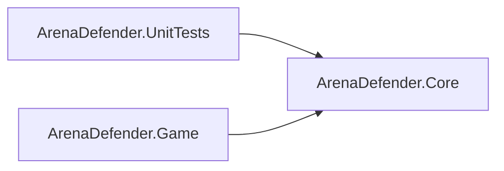
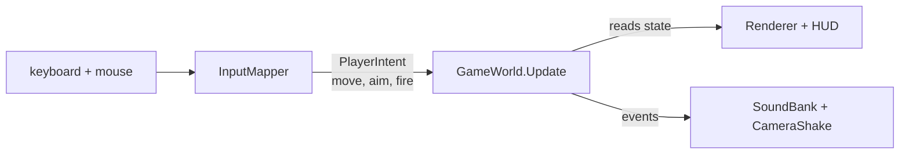
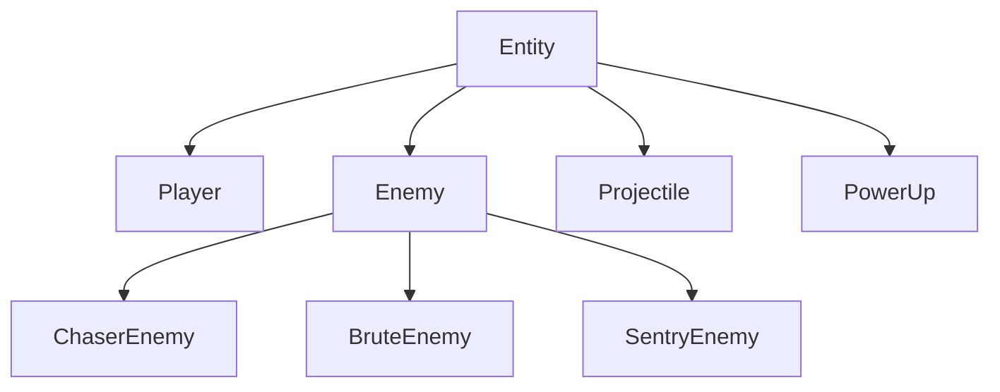

# Arena Defender: Architecture and Design

## The game

Arena Defender is a survival game. You hold one arena for as long as you can while waves of enemies arrive from every edge, faster and harder the further you progress. The game ends when they take you out.

You start each run with 100 HP and 3 lives.

Controls:

- Move: W A S D or the arrow keys
- Aim: move the mouse, or aim in the direction you are moving
- Fire: left mouse button
- Pause and resume: Escape
- Start a run, or play again: Enter
- Pick a pause menu item: ↑ ↓, then Enter

**The run.** Waves come at you from the edges of the arena. Each wave is bigger than the last: 8 enemies in the first, two more every wave after. And they arrive faster, the gap between spawns tightening from 1.6 seconds to 0.7 by wave 8, then shrinking to 0.97x of the last wave's gap after that. The more you survive each wave the more enemies are sent to attack.

**Your weapon.** Every shot releases a single projectile that deals 25 damage, and you can fire every 0.22 seconds. That's the starting point. Your weapon grows with you: at waves 8, 17, and 26 you permanently gain one extra projectile per shot, up to four fired at once, fanned out so each projectile sits 0.14 radians (about 8 degrees) from the next.

**Scoring.** Kills add points, a chaser is worth 100, a sentry 250, a brute 300, and kills landed quickly build a combo multiplier. Every kill within 2.5 seconds of the last adds a quarter to the multiplier, climbing to a cap of 5x. Take a hit and the chain breaks back to 1x.

**Power-ups.** Defeated enemies drop power-ups about 1 in 5 times. Each one you grab pays 50 points on top of its effect:

- Repair: restores 35 HP instantly
- Rapid Fire: you fire 2.1x faster
- Double Damage: each projectile's damage doubles, from 25 to 50
- Boosty Boost: you move 1.45x faster
- Shield: two charges that absorb hits

Rapid Fire, Double Damage and Boosty Boost are timed effects: each runs on its own timer, lasting 8 seconds early on and growing to 12 seconds as you progress (maxes out at wave 25). The 50 points are flat and separate from the combo, so grabbing one is always worth something even mid-fight.

**Bonus.** Every wave that's a multiple of 7 grants a bonus to the player: if you have full 3 lives you get 2,500 points, otherwise an extra life. It gives the players a chance at redemption and a way to stay in the fight.

**The enemies.** Three types, each with a job, and they do not all turn up at once: the opening waves are chasers, with sentries and then brutes mixed in as you progress. Enemy damage scales with the wave, doubling by wave 20, so the numbers below are the starting values:

- Chasers dive straight at you, fast and fragile. They deal damage and die on collision. 30 HP, 8 contact damage.
- Brutes are slow and armoured, soaking hits before they go down. 140 HP and 22 contact damage.
- Sentries keep their distance and shoot from outside your reach. 60 HP and 10 contact damage, with 12-damage shots.

## How it's put together

The game is built as three projects, and the split is the most important decision I made.

- **ArenaDefender.Core**: the rules. Movement, health, damage, spawning, difficulty, scoring, power-ups, collision. It is fully functional independently, and the game is built around it, with MonoGame as the presentation layer. All the numbers above live here.
- **ArenaDefender.Game**: the MonoGame host. The window, graphics, frame loop, input, sound and drawing. It drives the simulation through the world's public methods (update, start a run, return to menu) and reads state for drawing; it never reaches into the internals directly.
- **ArenaDefender.UnitTests**: the tests. They reference Core only, so there is no path for a rendering concern to leak into a rule.

**Why the split matters in-game.** Because Core has no graphics dependency, the rules can be tested without opening a window. And because the game can only reach the world through its public API, the display cannot silently change how the game plays. Input crosses the boundary as a plain PlayerIntent (move, aim, fire), and the world broadcasts events the host listens to for sound and screen shake. The rules decide; the game shows the result.

**Object-oriented design.** Core is where the C# and OOP live.

- **Inheritance.** Entity is the abstract base for everything in the arena: Player, Enemy, Projectile, PowerUp. Enemy adds health, damage and the steering contract, and each enemy type (Chaser, Brute, Sentry) implements steering its own way. Adding a new enemy type is one class and one line in the spawn picker.
- **Interfaces.** IEnemyActions lets an enemy ask the world to fire a projectile without touching the projectile list. IRandomSource lets tests swap real randomness for scripted randomness. Both depend on an abstraction, not a concrete thing.
- **Encapsulation.** Health and lives have private setters, the power-up multipliers are internal so only Core can write them, and the world's entity lists are exposed read-only. Nothing outside Core can put the game into a broken state.
- **Abstraction.** The host only knows the world's surface (update, start a run, return to menu, events, state reads). It never sees how a wave is chosen or how damage is computed.

**How it got built.** The rules came first. The opening five commits are all Core: configuration and maths helpers, the entity base, input and enemies and projectiles, the player and difficulty and scoring, then collision and power-ups and the wave director. Nothing was on screen until the third day. The three project split was there from the first commit, not something I refactored into later.

Balancing took longer than building did. The player started out close to unkillable, so I nerfed the player and buffed the enemies, and two fixes came out of playing the same problem over and over. Chasers used to sit on the player after contact, so once the immunity wore off they carried on chewing through health; now they spend themselves on impact. Waves used to overlap, the next one arriving before the last had cleared, which was diabolical and left no room to breathe; now there is a two second break between them.

I still cannot get past wave 36. I thought about giving the weapon more damage or a faster fire rate, but by then I was changing a number, playing again, and seeing almost nothing move. What this needs now is somebody else to come and play it.

## What each part does in the game

**The player.** The player gets 0.6 seconds of immunity after any hit that lands, and 2 seconds after respawning. When you lose a life you respawn back with your remaining lives, the wave refreshes, and you get to retry on the same level. If you were on your last life, it is game over, and you are taken to the game over screen where you are shown your session stats: enemies defeated, the number of the last wave you were on, your accumulated points, and your position on a scoreboard, capped to only three per session.

**The enemies.** All three share the same base: health, contact damage, and a score on death. Each type overrides one method, and that single override is the entire difference between them. None of them track you on their own: every frame the world hands each enemy your current position as an argument, they store it, and their steering reads from that stored copy. So they always know where you are without ever holding a reference to you.

- Chasers re-aim at you constantly and hold full speed, with no turn limit and no slowdown. Every update it takes the direction from itself to you, normalised into a unit vector, and rides it at full throttle. At 165 units per second there is nothing to out-turn, only outrun. On later waves and huge crowds they are the most annoying to deal with.
- Brutes turn slowly, capped at 1.5 radians per second (about 86 degrees per second). The cross product of its facing and the direction to you decides which way it turns, and a dot product of the two tells it how aligned it is: while badly misaligned it moves at 35% of its own top speed, ramping back up to full as it lines you up. So they lumber into position rather than chase, and you can circle one.
- Sentries keep their distance away from you at roughly 300 units, strafing side to side. A sentry fires a 12-damage shot every 1.35 seconds, only when locked on.

**Projectiles.** Only the player and the sentry shoot. Your shots travel at 620 units per second and live for 2.5 seconds, so they cover about 1550 units before they fade. A sentry's shots travel at 340 units per second, a little over half your speed, and reach roughly 850 units before they fade out. The sentry's aiming is the technical part: it never locks on by default, only locks on when the player sits inside its vision cone. The cone itself is a dot product, a comparison between its facing and the direction to you against the cosine of a 26 degree half-angle, out to 420 units. The cone sweeps back and forth at 0.9 radians per second rather than tracking you. When it fires, the shot is aimed mostly along the swept facing with only a small lean toward you, so it is never accurate enough to land every shot, and that gives you a chance to survive.

**Power-ups.** The drop leans toward a repair when you need it: below 45% health there is a 55% chance the drop is a repair, so a hurt player is quietly given a way back.

**Difficulty.** One curve turns the wave number into everything. Enemy speed climbs to 1.15x by wave 12, and sentries fire 2% faster per wave once the spawn ramp tops out at wave 8, which is about 1.2x by wave 18. The ramp stays constant instead of spiking.

## Sound and assets

Sound is wired in via WAV audio files imported into MonoGame at runtime. There are six of them, five events and the menu music:

- `shot.wav`: every time you fire. Its pitch drops and volume climbs with your bullet count, so the same gun sounds heavier as it upgrades.
- `enemy_down.wav`: an enemy dies.
- `player_hit.wav`: the player taking damage.
- `pickup.wav`: a power-up is collected.
- `wave.wav`: a new wave begins.
- `lobby_music.wav`: loops on the menu screen, and it is the only asset the game can run without.

Each sound has its own minimum gap between plays, so a rapid-fire shot or a crowded kill reads as distinct hits instead of stacking into one blur, and its own volume, tuned per sound. MonoGame throws when too many sound instances try to play at once, and that is wrapped in a try/catch, so the odd dropped sound is fine.

The sprites come from Kenney's Simple Space pack (kenney.nl, CC0) and the background from OpenGameArt's space background set (CC0). Plain PNGs and JPGs, copied into the build output and loaded at runtime, cached by file name so each one is read from disk once and reused for every copy. The arena field, health bars and every plain rectangle are drawn by stretching a single white pixel texture and tinting it, which is why the game needs no art for them. One real gotcha came from the art itself: sprites with transparent edges rendered with a white halo until they were loaded with premultiplied alpha.

All text, the HUD and the menus alike, is drawn from a single bitmap font, `font_atlas.png`, a 5x7 monospace atlas in a 16-column grid. Because it is a picture of the alphabet rather than a system font, the game never depends on a font being installed, and each glyph is drawn one at a time from the atlas. Lowercase draws from the uppercase cell, and anything outside the printable range falls back to a solid square.

## The maths

All of it lives in one place, GameMath, so every mechanic uses the same few operations. Each one does something you can feel in-game:

- DirectionTo and SafeNormalize turn "where is the player" into the direction to head. Every enemy uses it to aim its movement, and the player's input uses it for move and aim directions. It is why a chaser 800 units away and a chaser 80 units away both close in at the same speed.
- Distance and IsWithinRange answer "how far apart are we". A sentry only registers you inside its 420-unit range, a power-up only starts drifting to you when you get close enough, and a sentry holds its distance at 300 units.
- Dot product tells you how aligned two directions are. It is what the sentry's vision cone tests, and what throttles a brute's speed down to 35% of its own while it is still turning.
- Cross product tells you which side one direction sits on. It is what picks a brute's turn direction.
- Lerp moves a value from one end to another and is used four separate ways by the difficulty curve: spawn interval, enemy speed, enemy damage, and power-up duration all climb from a start to a cap as the wave number grows. The brute's speed ramp uses it too.
- LerpAngle is the angle version of Lerp, aware that 359 degrees and 1 degree are next to each other. The player's facing and the sentry's sweep use it so rotation never spins the long way round.
- FromAngle and ToAngle convert between a direction vector and an angle. Shots are fired by turning your facing into an angle, adding the spread, and converting back; the sentry's swept aim and the brute's capped turn step do the same.
- Damp eases a value toward a target instead of jumping. A power-up drifts toward you, easing in as it gets closer, instead of snapping to your position.
- Remap takes one range and shifts it onto another. The wave director uses it to decide when sentries and brutes start appearing: the deeper into the run, the higher the chance.
- Plain arithmetic does the rest. The combo multiplier is 1 + 0.25n clamped at 5x, contact damage is a base value times the wave's damage scale, and a kill's score is its base value times the current combo.

## Data structures and enums

The project uses four enums:

- GameState (Menu, Playing, GameOver): which screen the game is showing. Pausing is not one of them: the host handles pause by simply not calling the world's update, so Core never knows the game was paused.
- PowerUpKind (Repair, RapidFire, DoubleDamage, BoostyBoost, Shield): which power-up a pickup gives.
- ProjectileOwner (Player, Enemy): who fired a shot.
- GameSound (Shot, EnemyDown, PlayerHit, PickUp, Wave): which event makes which sound.

The data structures are the plain ones that fit the job:

- Power-up timers are stored in a dictionary keyed by kind, each entry holding the time left and the total time. Want to know if an effect is running, or refresh it? A lookup by name, not a scan through a list. Repair and Shield act instantly, so they never enter the dictionary, only the timed effects do.
- Entities: enemies, projectiles and pickups live in plain lists. A dead one is deactivated in place, then a single sweep at the end of each update removes every inactive entry. Nothing gets deleted mid-frame while other code is still reading the lists, so iteration never breaks. The lists go out as read-only views, so the host can draw them without adding or removing anything.
- The session scoreboard: a small list of integers. Each finished run adds its score, the list sorts highest first, and only the top three show up.

**Leaderboard.** It only saves per session, per run of the project. Once execution is stopped the leaderboard goes with it, the data is not persistent and nothing is saved to disk locally.

## Exception handling

The game treats exceptions the same way in both layers: the simulation refuses nonsense before it exists, and the host turns anything that goes wrong in the real world into a message you can act on.

**The simulation never half-runs.** Core does not catch exceptions, because it never puts itself in a position where one has to be caught. An enemy cannot be built with negative health, a negative top speed, or a negative score, and a projectile cannot be built with negative speed or damage. Each constructor refuses those values before the object exists, so a broken enemy is caught the moment it is created, not discovered mid-wave.

**The host turns real-world failures into readable messages.** The one thing that genuinely goes wrong with a built game is that the assets are missing, usually because the Assets folder was not copied next to the executable. A missing texture makes the game say exactly that and tell you to copy the folder across, instead of dying with a stack trace. The font does the same, and if the graphics device was never created the game says so plainly.

**One safety net at the top.** If something the developers did not foresee throws, Program.cs catches it, prints "Arena Defender terminated unexpectedly." with the details, and exits with code 1, so a crash is never silent.

**Audio is the only part of the game allowed to fail.** A machine with no audio device, a missing music file, or too many sounds playing at once can never stop the game. Missing music means no music. An overloaded sound card means one dropped sound. No audio device at all means the whole sound bank is skipped and the game runs silently. Every other asset is required, and loudly refused when absent.
