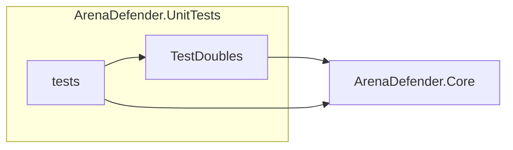
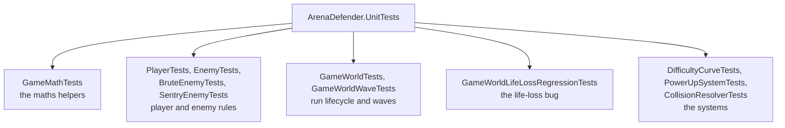
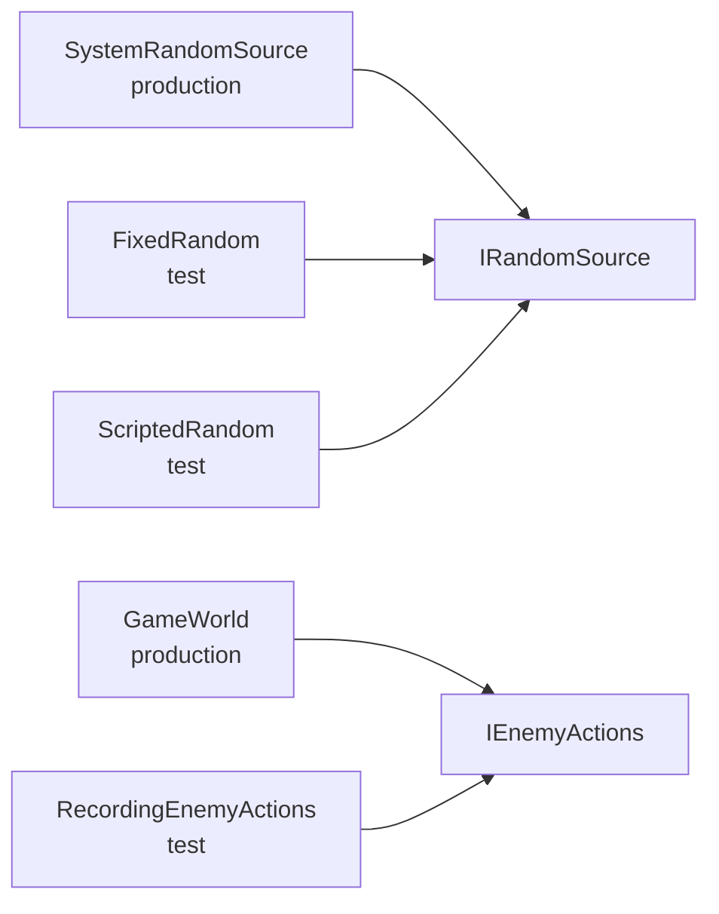

# Arena Defender: Testing Strategy

## The approach

The tests are written in xUnit and live in a dedicated project, ArenaDefender.UnitTests. It references exactly one thing: ArenaDefender.Core (the simulation). The host project, ArenaDefender.Game, is not referenced, so the whole suite is MonoGame-free.

That choice is the point. Core has zero MonoGame dependency, which means every test can build a GameWorld, run Update frames against it directly, and assert on the result without a graphics device, a window, or an audio card.



One command runs the entire suite:

```
dotnet test
```

**The results.** The suite holds 32 test methods across 11 files, and `[Theory]` inputs expand those into 47 executed cases. All of them pass:

```
Passed! - Failed: 0, Passed: 47, Skipped: 0, Total: 47
```

The tests talk to the simulation through four stand-ins, each a different tool:

- FixedRandom pins every roll to a single value, forcing one branch of a probabilistic decision so a test can assert it directly.
- ScriptedRandom plays back a caller-supplied sequence, so a run of decisions can be dictated in order.
- RecordingEnemyActions counts shot requests instead of creating projectiles, so an enemy can be tested without a world.
- TestEntity is a bare entity with no gameplay behaviour, so collision geometry can be exercised exactly where the test wants it.

Having both FixedRandom and ScriptedRandom is itself evidence the randomness is properly injected: one forces a single branch, the other dictates a whole sequence, and the simulation accepts both because it never reaches for randomness on its own.

**The coverage.** The tests divide into two kinds of target. Happy-path tests prove a rule works as intended. Edge-case tests prove a rule holds at its boundary, which is where games actually break:

- exact-touch collision (Overlaps returns true when two circles just meet),
- the angle wrap (LerpAngle takes the 20 degree step from 170 degrees to -170 degrees, not the 340 degree spin),
- a negative range (IsWithinRange throws instead of misbehaving),
- a null argument (constructors and overlap checks throw),
- contact kills versus projectile kills (a chaser dying on contact does not score),
- the last life (losing it ends the run),
- losing a life mid-wave (the wave restarts rather than clearing),
- frame-rate independence (Damp lands in the same place at 30 fps and 60 fps).

The suite includes both kinds, because the boundary is where the logic decides what the player experiences.



## What makes the simulation testable

The simulation never reaches for anything on its own. Everything it needs is handed to it through two interfaces, and a test can supply its own version of either.

**Randomness.** The simulation takes an IRandomSource as a constructor argument instead of calling Random directly. The host uses `new GameWorld()`, which builds a SystemRandomSource (a wrapper around `new Random()`). Tests use:

- FixedRandom: answers the same value every time. A random decision always lands the same way, so the test can assert exactly that.
- ScriptedRandom: contains a preset sequence of values, so when the test runs we already know the outcome of every roll.

**Enemy firing.** Of the enemies, only the sentry shoots, and it doesn't create its projectile. It reports what it wants to an IEnemyActions, and whoever implements that interface decides what happens. In the game, GameWorld implements it and spawns a real projectile. In tests, RecordingEnemyActions just counts the request. So a sentry test can assert "it eventually fires" or "it never fires" without a world.

**One plain helper.** TestEntity is a bare Entity subclass that only moves. A test places it where it wants the collision geometry to be.

The simulation asks for an interface and cannot tell which implementation it got. That is the whole claim of the section, drawn:



**Time and floats.** World tests step a fixed frame of `1f / 60f`. Tests that need to fill the arena without fighting step tiny `0.001f` increments instead. Tests that want an effect to expire jump straight to the end. Floats are compared against a tolerance: 1e-4 in the maths tests and 1e-3 in the world tests, because a single maths operation rounds once, while sixty frames of world simulation accumulate rounding.

**Bad input.** Bad input throws. A null dependency throws ArgumentNullException. A value outside the accepted range, like a negative range in IsWithinRange, throws ArgumentOutOfRangeException. Each test asserts the throw it expects, so a regression to silent handling fails the suite.

## What is tested, and why those

The tests target rules, not rendering. The host only draws and plays sounds, so there is nothing to assert about it without a window open. The simulation is where every decision lives: what spawns, what hits, how much damage lands, what the score becomes. That is what a test can reach.

Three reasons pick the rest. The maths is tested where it decides something the player feels, not for its own sake: the cone test matters because it is the difference between the sentry shooting at you and ignoring you. Boundaries are tested because that is where a game breaks: exact-touch collisions, a life hitting zero, the last wave. And the thing that broke once already is tested so it cannot come back; that one has a section of its own below.

**The maths.** Each shared helper gets a direct check. Lerp returns the proportional value. Distance matches the Pythagorean result. Dot returns the cosine of the angle between two unit vectors, and Cross reports which side one lies on. TurnDirection reports the shorter way to rotate, and LerpAngle takes that short arc across the wrap point: 170 degrees to -170 degrees is a 20 degree step, not a 340 degree spin. Damp lands in the same place after one simulated second at 30 fps and at 60 fps. IsInFieldOfView accepts targets inside the sentry's cone and rejects those outside. A negative range makes IsWithinRange throw.

**Entities.**

- The player: taking damage reduces health and reports a hit. Running out of health with lives left consumes a life and respawns you at the centre.
- The enemy base: difficulty scales speed and contact damage, and a killing blow deactivates the enemy exactly once.
- The brute: it cannot turn instantly, so its facing only edges toward the player, and it rotates along the shorter arc.
- The sentry: fires when the player is inside its cone and range, and never when the player is directly behind but well in range. In that test the range passes, so only the dot product can turn the shot away, which is the point.

**The world.**

- The run lifecycle is covered end to end. Starting a new run moves to Playing and resets everything. A player shot that hits an enemy destroys it and awards score. A chaser that reaches the player dies on contact without scoring, pinning down that contact kills are not kills. Losing the last life ends the run in Game Over.
- The wave tests cover the two ways a wave ends: clearing it advances the number, losing a life restarts it.

**The systems.**

- The difficulty curve gets three checks: enemy count grows by a fixed step each wave, the spawn interval keeps shrinking past the opening ramp, and damage scale starts neutral and rises to its ceiling.
- The power-up system raises the fire rate when RapidFire is collected, and returns every multiplier to one when the duration elapses.
- Collision overlap returns true when two circles exactly touch, and refuses a null argument.

## The regression test

`Update_WhenContactDamageCostsALife_DoesNotThrow` is the only test in the suite that asserts nothing was thrown rather than asserting a value, which is what makes it the example of a failing test and its fix.

**The bug.** Losing a life used to be able to happen in the middle of a frame's collision pass. Anything that damages the player runs from inside that pass: a sentry's shot, or an enemy touching you. When the damage emptied the player's health and a life was consumed, the code tried to clear the arena while the collision pass was still iterating the enemy list. The result was a crash mid-frame.

**The test.** The wave is configured to hold 40 enemies. The test steps the world until six enemies are on the field, then places every enemy on the field directly on the player's position. One frame of contact deals more than the player's 5 health, which is exactly the condition that used to crash. The test runs that frame through `Record.Exception` and asserts the result is null:

```csharp
Exception? caught = Record.Exception(() => world.Update(1f / 60f, PlayerIntent.Idle));

Assert.Null(caught);
```

Before the fix, `Record.Exception` caught the throw and handed it back, so `caught` was the exception instead of null and the assertion failed, with the exception message output.

**The fix.** The simulation now deactivates a dead enemy in place, and `RemoveInactive` sweeps them with `RemoveAll` at the end of the update. Nothing is deleted mid-frame, so a life lost during contact damage no longer breaks the iteration. Once the test showed the crash, the fix was straightforward.

**Why it stays.** The test replays the old failure on every run. If the fix silently regresses, the suite fails with a name that says exactly what happened: losing a life mid-collision no longer throws.

## What the tests cannot do

The tests cannot tell you whether the game feels right. Whether a wave is fair, whether a shot sounds punchy, whether a run is fun: that is checked by hand, by actually playing.

The sentry bug is the clearest proof. ArenaBounds.Clamp is called once in the whole codebase, on the player. Nothing fences an enemy in. A sentry holding its 300 unit distance reverses through the arena wall when you advance on it, and since enemies spawn 48 units outside the bounds by design, one with a 420 unit cone can fire on you from off screen. No unit test would ever catch that: the enemy cheats the bounds of the game. I found this out by playing.
